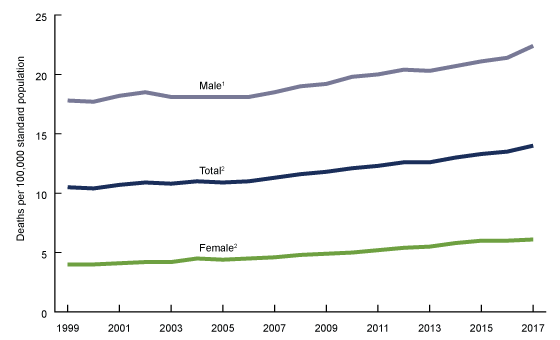
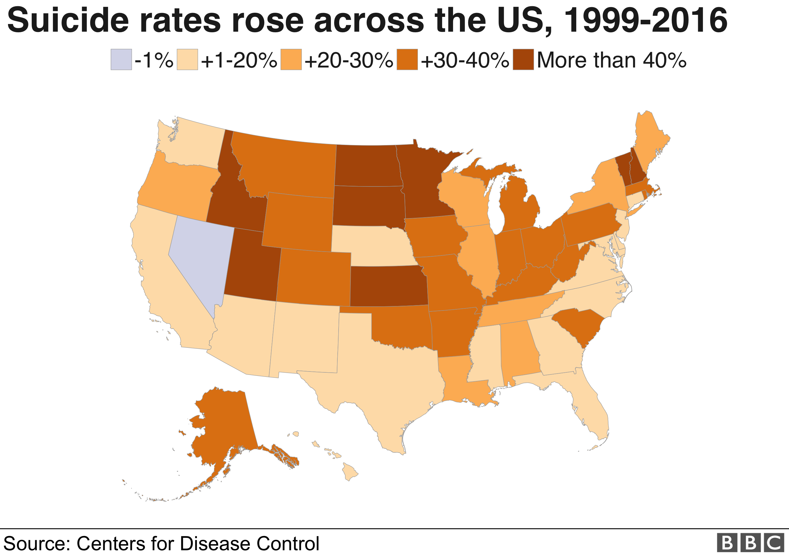

# *Appendix: P1: Report Outline* #
## Suicide Rates in the United States ##
### Project: finalprojectAH4 ###
#### Adrianna Mitalas, Betty Kao, Bobin Hu, and William Yu
Info-201: Technical Foundations of Informatics  
The Information School  
University of Washington  
Autumn 2019

### 1.0 Introduction
1. **Problem Situation:** The stakeholders in the problem of suicide in the United States is everyone and especially those suffering with a mental illness. The setting of this problem stems from many factors of the contemporary world including unemployment, income, and profession. Excess pressure from any of these categories can push someone into a depression and, depending on the course of events after that, lead to self harm or death. Up until recent years, mental health and treatment has been far from normalized so policies and ethics around it are still fairly new as children and adults seek treatment. This can pose a challenge that people do not feel extremely comfortable seeking help for their mental needs and can lead to many people suffering alone. Society and social media in the United States especially today rides on a key value of appearing as if life is perfect, flawless, and effortless; this can directly contribute to someone’s mental health and make them feel outcasted or ashamed if they feel different.
2. **What is the Problem?** The problem is the continuous rising of suicide rates in the United States and the disparities between the rates in each of the states. Idaho has some of the highest rate growth from 1985-2015 while Nevada has gone down 1%. 
3. **Why Does it Matter?** This matters because the trend of people committing suicide has been rising in the United States, this means more lives are being lost and could of been prevented. This also matters because it affects a lot of people around us and the country, especially in a stress-filled university like the UW. Moreover, preventing suicide will also promote positive energy in society and contribute to overall healthy growth for years to come.
4. **How it Will Be Addressed?** We will address this issue by proposing an education program implementation into schools across the United States to better educate, normalize, and help children, teens, and young adults about suicide, depression, and handling their mental health. This will help to lessen suicide attempts of young people and prepare the future generations of adults to seek help and spend time with their mental health issues. To help adults in the USA, we propose work time seminar that will teach and help the employees of companies about the importance of their mental health and what to do in crisis situations.

### 2.0 Research Questions
* Research Question 1: How do factors like unemployment rates, poverty percentage, and profession contribute to each state’s suicide rate?
* Research Question 2: What programs, societal changes, and overall trends have led to more people avoiding suicide? What has done the opposite?

### 3.0 Possible Data Sets
* Data Set 1: [Suicide Rate Overview 1985 to 2016](https://www.kaggle.com/russellyates88/suicide-rates-overview-1985-to-2016)
* Data Set 2: [US Unemployment Rates by County 1990-2016](https://www.kaggle.com/jayrav13/unemployment-by-county-us)

### 4.0 Information Visualizations

### 5.0 Team Coordination
1. Meeting Times:
* Monday: 3:30pm - 6:30pm
* Tuesday: 9am - 10am(back up)
* Friday: 3:30 - 6:30(back up)

2. Have fun :)

3. We are communicating weekly on messenger and in section

4. We will give feedback and will address challenges in person by discussing in a group what is best for the team.

### 6.0 Questions for Teaching Team

### 7.0 References
Hedegaard, Holly, et al. “Products - Data Briefs - Number 330 - September 2018.” *Centers for Disease Control and Prevention*, Centers for Disease Control and Prevention, 3 Oct. 2018, www.cdc.gov/nchs/products/databriefs/db330.htm.
Prasad, Ritu. “Why US Suicide Rate Is On the Rise.” *BBC News*, BBC, 11 June 2018, www.bbc.com/news/world-us-canada-44416727.
